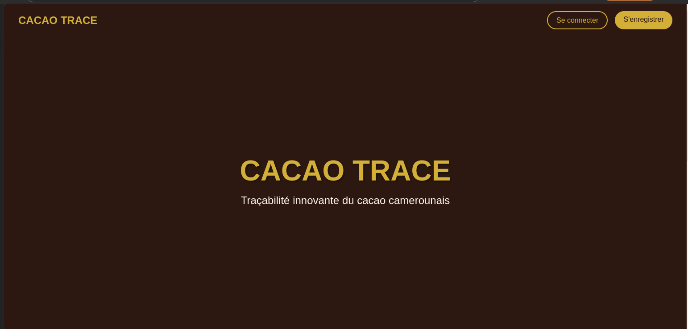
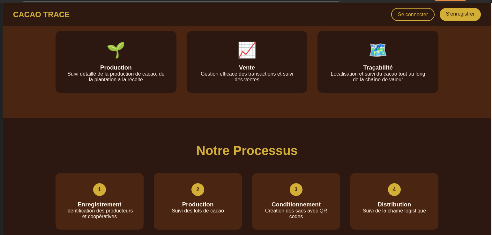
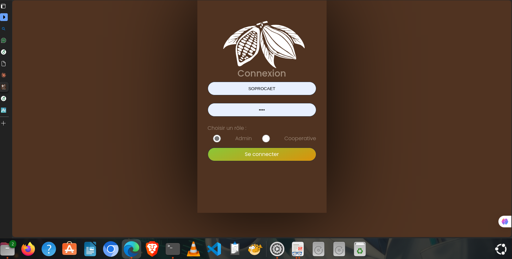
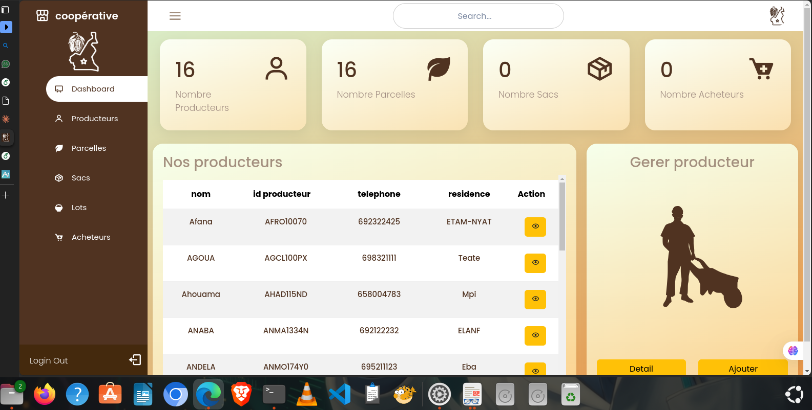
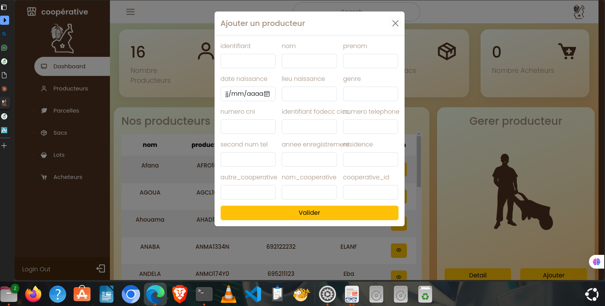
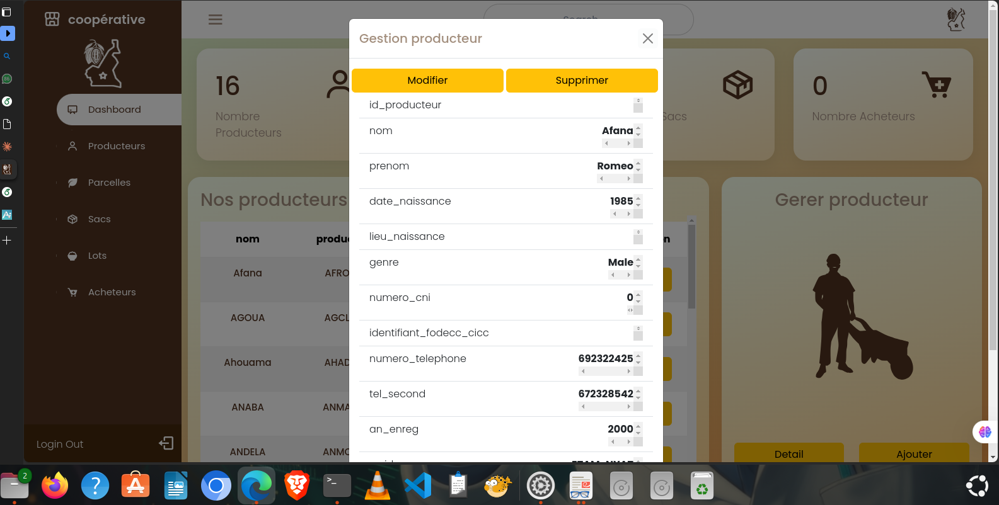
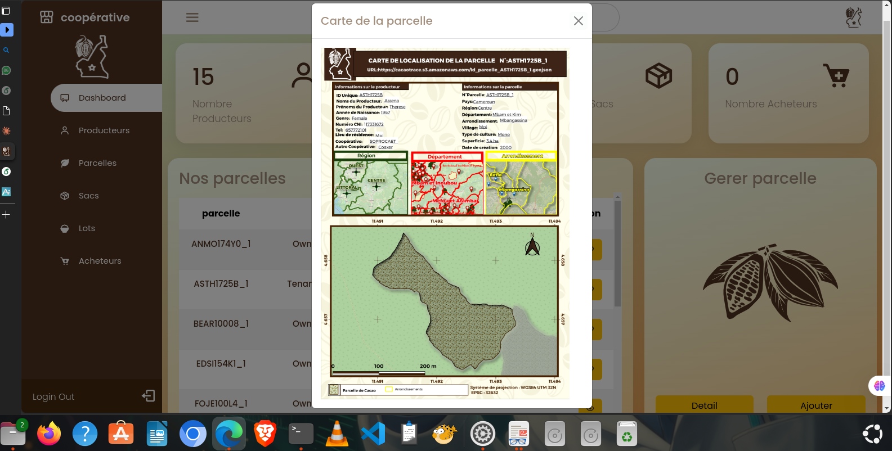
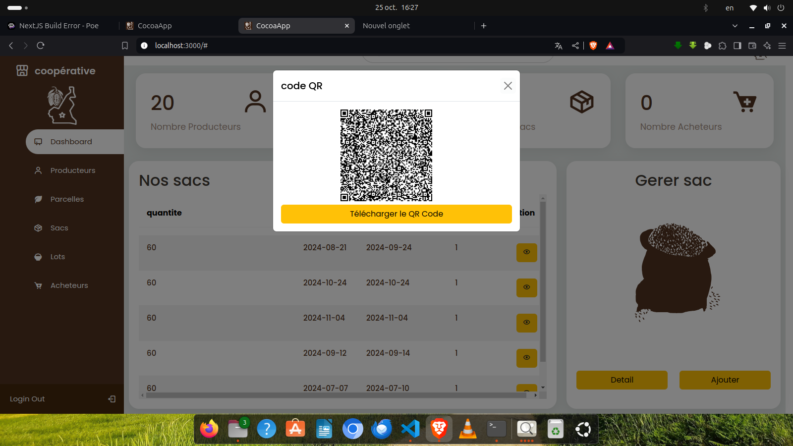

# Application-cacao-trace
## Présentation de l’Application
### Objectifs
**L’application Cacao Trace a pour principaux objectifs de**:  
**• Garantir la traçabilité du cacao de la production à la vente.**  
**• Faciliter la gestion des informations relatives aux producteurs, coopératives et acheteurs.**  
**• Générer et gérer des QR codes dynamiques pour assurer l’authenticité et la transparence des lots de cacao.**  
**• Intégrer la géolocalisation pour suivre en temps réel les acteurs et les flux de cacao.**  

**`Contexte et Justification`**  
Dans un secteur où la traçabilité et la qualité sont des critères essentiels pour accéder aux
marchés internationaux et obtenir des certifications, Cacao Trace répond à un besoin crucial
du secteur cacaoyer camerounais en proposant une solution innovante et numérique.

**`Presentation de l'interface`**  

